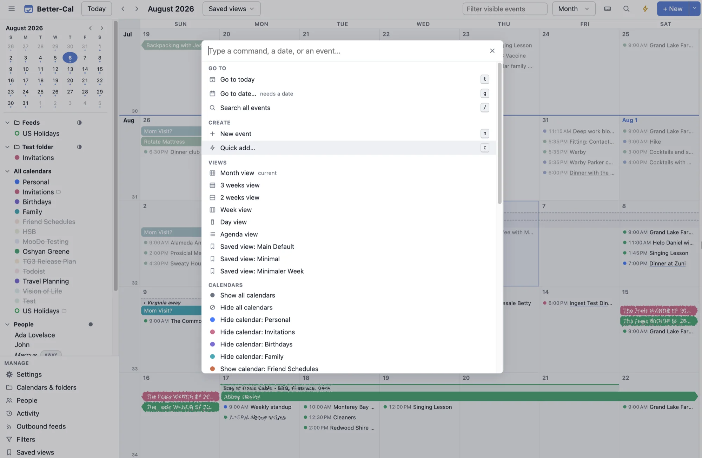

# Better-Cal

**An opinionated calendar that questions the status quo.**

*Built for power users, and inspired not merely by the wish to self-host but by a question: can calendars actually be made better and easier to use?*

A self-hosted calendar built to fully replace Google Calendar: everything GCal does day-to-day, plus an activity log with undo, email-to-event ingest with real RSVP replies, trips and people as first-class objects, natural-language everything, and an agent-native API. Plain PHP + MySQL backend, no-build Preact frontend, CalDAV for native clients.

**[Full feature list → FEATURES.md](FEATURES.md)**

## What this is, and isn't

Better-Cal is built for one person's daily use and runs their real calendar every day. It is single-user by design: one login, one owner, everyone else reaches it through CalDAV, shared feeds and invitations. It is developed in the open because there is no reason not to, not because it is a product. There is no support commitment, no roadmap promise and no compatibility guarantee between versions, though migrations are always provided. Issues and pull requests are welcome; expect honest answers about what will and will not be taken on.

## License

MIT, see [LICENSE](LICENSE). Use it, fork it, host it, sell it. If you build something on it, a link back to this repo is appreciated but not required.

## Stack

- Server: PHP 8.4, MySQL, no framework. CalDAV via sabre/dav. Cron worker for feed polls, mail ingest, reminders, ranking, and retention.
- Web: Preact + HTM served directly (no build step), installable PWA.
- Optional: LLM provider key for natural-language assist, prompt filters, and ranking; MapTiler key for map tiles; SMTP for reminder email and iMIP RSVP replies.

## Docs

- [Installing](docs/install.md): requirements, steps, and web server setup for Nginx (tested) and Apache (untested)
- [Architecture](docs/architecture.md)
- [API contract](docs/api-contract.md) and [agent API](docs/agent-api.md)
- [Calendar roles and event relationships](docs/relationships.md): planned, maybe, available, context; what a calendar is to you and what that makes its events
- [CalDAV](docs/caldav.md)
- [Email ingest](docs/email-ingest.md)
- [Moving from Google Calendar](docs/migration.md): test it without changing anything at Google, run both for a while, switch fully, or go back
- Roadmap: the [GitHub issues](https://github.com/Oshyan/better-cal/issues); there is no separate roadmap document

## Configuration

Copy [`.env.example`](.env.example) to `.env` in the app root and fill it in. It lists every setting the server reads, with what each is for; only the database, base URL and session secret are required. Create the account with `php server/bin/seed.php --email=... --password=...`. Running it again for an existing account resets the password and signs every browser out; add `--revoke-tokens` after a suspected compromise to also revoke all API tokens.

## Development

- Deploy: `./scripts/deploy.sh` (rsync, composer, migrations, smoke check).
- Tests: `php server/tests/run.php` (server, pure PHP), `node web/tests/smoke.mjs` (frontend logic; passes in any time zone, and the deploy scripts run it under five), `node --experimental-vm-modules web/tests/static.mjs` (module graph), `node tools/mcp/test.mjs` (MCP server).
- Chrome extension (redirects Google Calendar add-links): `extension/`.
