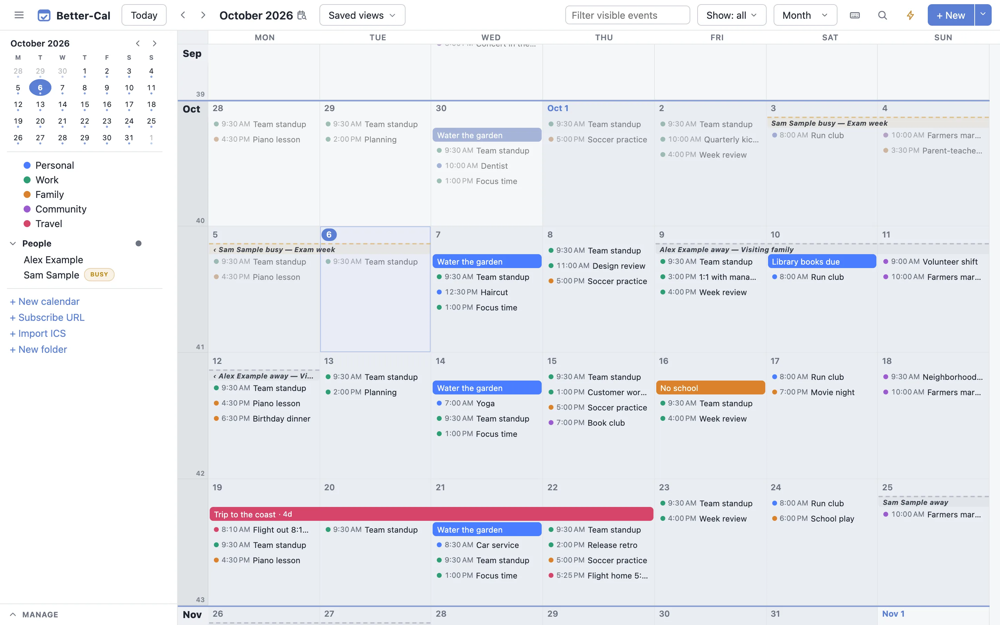
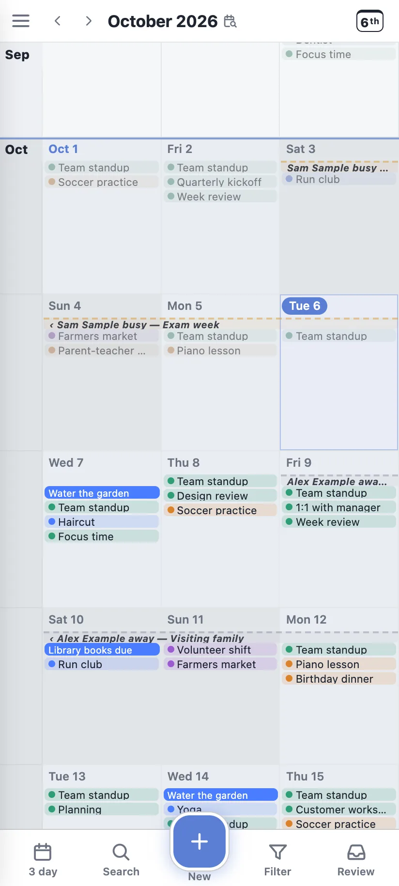
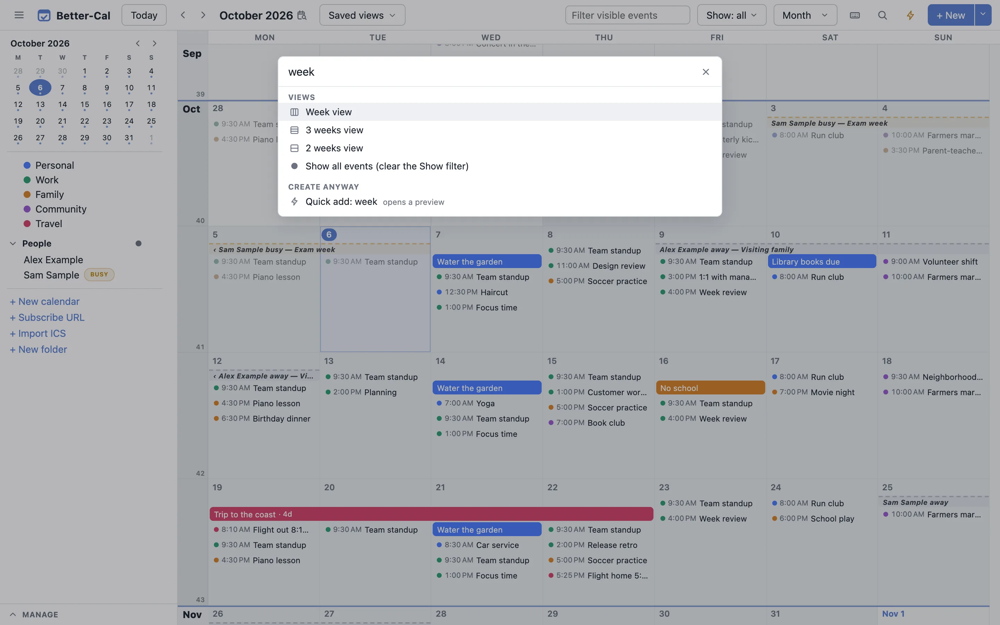

# Better-Cal

**An opinionated calendar that questions the status quo.**

*Built for power users, and inspired not merely by the wish to self-host but by a question: can calendars actually be made better and easier to use?*

A self-hosted calendar built to fully replace Google Calendar: everything GCal does day-to-day, plus an activity log with undo, email-to-event ingest with real RSVP replies, trips and people as first-class objects, natural-language everything, and an agent-native API. Plain PHP + MySQL backend, no-build Preact frontend, CalDAV for native clients.

**[Full feature list → FEATURES.md](FEATURES.md)**

<table>
<tr>
<td align="center"></td>
<td align="center"></td>
<td align="center"></td>
</tr>
<tr>
<td align="center">Month view</td>
<td align="center">Phone</td>
<td align="center">Command palette</td>
</tr>
</table>

Click a screenshot for full size. Invented sample data; `php server/bin/demo-seed.php` loads the same into a fresh install.

## What this is, and isn't

I wanted infinite scroll in a calendar. That's the whole origin story: Google Calendar has never had it, people have been asking for it for years, and one evening I sat down with Claude (Fable 5) to see how far a calendar with infinite scroll could get. By morning there was a working one. Within a week it had replaced Google Calendar for me outright, and by then it did a number of things GCal doesn't and probably never will: undo for everything, trips and people as real objects, a relationship to every event that tells "what am I doing" apart from "what could I do" and "what's the weather", feeds that are actually pleasant to live with, and an API that an agent can drive as well as I can.

So this is built for one person's daily use, and it runs my real calendar every day. It's single-user by design: one login, one owner, everyone else reaches it through CalDAV, shared feeds and invitations. It's developed in the open because there's no reason not to, not because it's a product. There's no support commitment, no roadmap promise and no compatibility guarantee between versions, though migrations are always provided.

What I focused on, and where that shows:

- **Desktop first, phones close behind.** I use this on a laptop with a keyboard, so that's where the polish started: hotkeys for everything, a command palette, drag and drop that behaves. Phones got a pass of their own from 0.4 to 0.8: an installable app with a split month (dense weeks over a list that scrolls with them), an event sheet you can step through, a full-screen editor, and Back that works everywhere. It's used daily on Android. It hasn't been tried on an iPhone yet, so reports from iPhone users are especially welcome.
- **Questioning defaults.** Wherever Google Calendar does something because it always has, I asked whether it's actually good. Sometimes it is and I kept it. Often it isn't: that's where infinite scroll, the Show filter, context in the day header and the honest "can't be undone" on Google writes come from.
- **Feeds and other people's calendars as first-class**, not as a grudging import. Most of what's on my calendar didn't originate with me.
- **Honesty in the interface.** The app says what it did, what it can't undo, and what it's hiding from you.

Issues and pull requests are welcome; expect honest answers about what will and won't be taken on.

## Security

Security is taken seriously here, which for a one-person project means verified work in public rather than promises:

- **Three full security scans** of the whole codebase so far (Codex Security in August and September 2026, Claude Security on 2026-09-23), each with independent verification of every finding.
- **Every finding fixed**, deployed and verified on the reference install, with the fix commit naming the finding. The 2026-09-23 round found 29 issues (none High or Critical); all were fixed the same day.
- **Adversarial review of the fixes themselves**: three further passes looked for incomplete fixes, bypasses and regressions the fixes introduced, and those were fixed too (0.1.6 to 0.1.8).
- **Published advisories**: the 2026-09-23 findings were published as GitHub security advisories; [SECURITY.md](SECURITY.md#past-advisories) lists each with the affected and patched versions.
- A test suite that runs on every change and before every deploy, including regression tests for the security fixes.

[SECURITY.md](SECURITY.md) has the details, the residual risks that were accepted rather than fixed, the design trade-offs made on purpose (such as staying signed in on your own devices, and what to do if one is lost), and how to report a problem privately.

## Versions

Releases are tagged (`v0.1.1`) and listed on GitHub; `CHANGELOG.md` says what changed and why, and the running version shows in Settings. Below 1.0, minor versions carry features and behaviour changes, patch versions carry fixes.

## License

MIT, see [LICENSE](LICENSE). Use it, fork it, host it, sell it. If you build something on it, a link back to this repo is appreciated but not required. Bundled and installed third-party software keeps its own licenses, listed in [THIRD_PARTY_NOTICES.md](THIRD_PARTY_NOTICES.md).

## Stack

- Server: PHP 8.4+, MySQL 8 or MariaDB 10.6+, no framework. CalDAV via sabre/dav. Cron worker for feed polls, mail ingest, reminders, ranking, and retention.
- Web: Preact + HTM served directly (no build step), installable PWA.
- Optional: LLM provider key for natural-language assist, prompt filters, and ranking; MapTiler key for map tiles; SMTP for reminder email and iMIP RSVP replies.

## Docs

- [Installing](docs/install.md): requirements, steps, and web server setup for Nginx and Apache (both tested), on MySQL or MariaDB; shared hosting works
- [Architecture](docs/architecture.md)
- [API contract](docs/api-contract.md) and [agent API](docs/agent-api.md)
- [Calendar roles and event relationships](docs/relationships.md): planned, maybe, available, context; what a calendar is to you and what that makes its events
- [CalDAV](docs/caldav.md)
- [Email ingest](docs/email-ingest.md)
- [Moving from Google Calendar](docs/migration.md): test it without changing anything at Google, run both for a while, switch fully, or go back
- Roadmap: the [GitHub issues](https://github.com/Oshyan/better-cal/issues); there is no separate roadmap document

## Configuration

Copy [`.env.example`](.env.example) to `.env` in the app root and fill it in. It lists every setting the server reads, with what each is for; only the database, base URL and session secret are required. Create the account with `php server/bin/seed.php --email=...`, which asks for the password (or reads `BETTERCAL_SEED_PASSWORD` when run from a script). Running it again for an existing account resets the password and signs every browser out; add `--revoke-tokens` after a suspected compromise to also revoke all API tokens.

## Development

- Deploy: `./scripts/deploy.sh` (rsync, composer, migrations, smoke check).
- Tests: `php server/tests/run.php` (server, pure PHP), `node web/tests/smoke.mjs` (frontend logic; passes in any time zone, and the deploy scripts run it under five), `node --experimental-vm-modules web/tests/static.mjs` (module graph), `node tools/mcp/test.mjs` (MCP server). GitHub runs all of them on every push, plus a fresh install from the lock file on PHP 8.4, the minimum.
- Chrome extension (redirects Google Calendar add-links): `extension/`.
